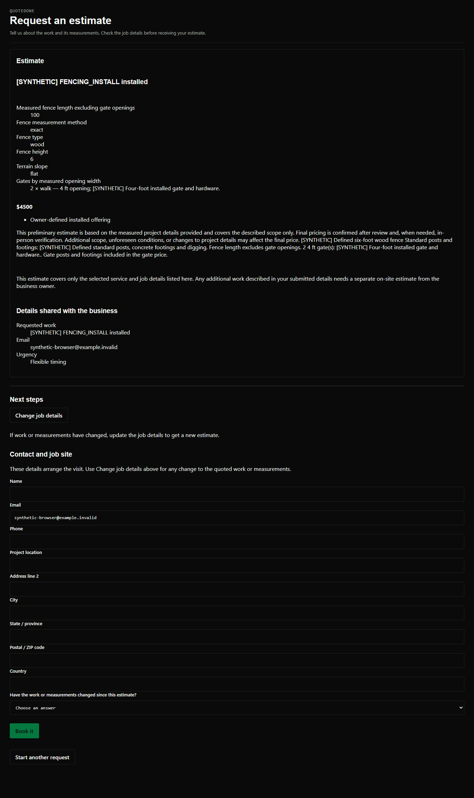
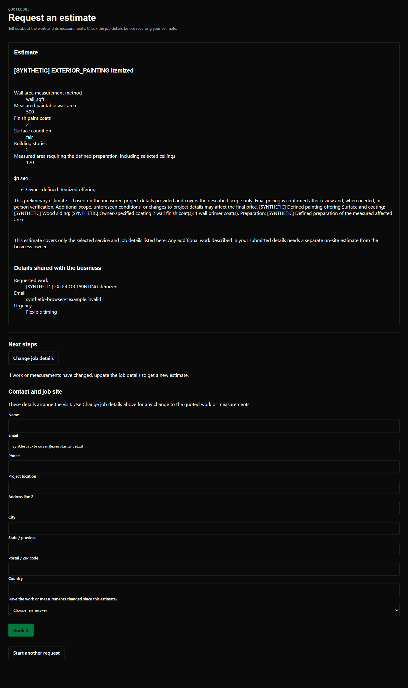

# Fencing, painting and booking repair result — September 30, 2026

The owner-approved fencing and painting offerings now produce verified prices through the real application and normal customer interfaces. Booking confirmation no longer accepts an unconfirmed or mismatched provider event. No full phase or public-launch gate has passed: live provider acceptance and unfinished product areas remain separate.

Tested application and verification source: **`06c6fbeec94e3c87040964c24a7a0f45f2837e2d`**, following implementation `8b863f0a79f77a40ddc4de1bd0259ccfc3b13f43`. Both checkpoints were saved and every changed file was read back from GitHub byte-for-byte. This delivery adds documentation/evidence and updates build-status prose; it does not change that tested runtime. PR #3 stays draft.

## Repaired findings

1. **Fence installation/replacement and exterior painting could not quote complete supported requests. Interior painting preparation was incomplete.** The original 30 application responses confirmed fence/exterior and fair/poor interior cases went to review, while the good-condition measured interior control already quoted $1,650. New owner-approved offerings support complete installed prices or itemized measured components, selected per offering. Existing pricing fields retain their meaning; no default owner rate or new markup cap was introduced.
2. **Cancelled/tentative or wrong-time provider events could confirm a booking.** The original real application matrix reproduced nine false confirmations in 24 cases, including incorrect appointment records and booked outbox events. The repair checks the intended event identity, explicit confirmed status, and exact start/end instants on create, ambiguous-write recovery and polling. All 24 repaired outcomes pass. Equivalent timezone offsets representing the same instants still confirm. Wrong-day/wrong-duration events remain pending in the real widget until the matching event is returned.
3. **An approval reload could erase a measurement entered immediately afterward.** Two final browser attempts reproduced a missing fence length after approval refreshed the saved book. The editor now finishes the save/approval reload before accepting further edits. Deliberately delayed responses verify this protection for both pricing and measurements; all eight owner workflows subsequently produce their independent expected totals.
4. **The customer summary displayed internal identification data.** Summaries now show readable selected-job and gate details. Internal offering IDs remain in the original submitted record and calculation evidence, without appearing in the customer summary.

## Price controls

These are explicitly synthetic test prices, never defaults for a business. Each total was checked through public submission, authenticated calculation and owner preview, and through both the full-page form and production widget.

| Offering | Complete installed price | Itemized price |
|---|---:|---:|
| Fence installation | $4,500 | $3,920 |
| Fence replacement | $4,900 | $4,320 |
| Interior painting | $3,800 | $2,524 |
| Exterior painting | $3,000 | $1,794 |

[Owner ruling and precise inclusions](OWNER_OFFERINGS.md) describes the measurement and rate meanings. Installed fence length excludes gate openings; itemized fence pricing uses an explicitly confirmed post count. Painting uses measured paintable areas and defined coats, preparation and primer. Itemized material rates are measured-area selling prices, not a claim of can/package purchase takeoff.

## Concerns ruled out or narrowed by controls

- Interior painting was not wholly unavailable: the original good-condition measured control worked and remains supported.
- The repair does not make all requests review-only. All eight new complete offerings quote through every tested application/customer path.
- A separately declared unpriced job preserves the supported selected-job price and its own on-site estimate notice. Unknown or contradictory facts about the selected job still cannot produce a customer-ready subtotal.
- Exact retry, callback-contact rejection/editing, name-optional estimates, decimal fidelity, partial-option notices, saved approval, permissions, tenant isolation and original-record persistence pass their affected regressions.
- A synthetic rate-limit interruption, several test assertion/setup errors, the v3 browser interceptor cleanup error and the initial legacy page-load timeout were not accepted as product fixes. Their original outputs remain classified separately.

## Final verification

Counts overlap and must not be added as unique coverage.

| Check | Result |
|---|---|
| Full engine regression, including new independent offering arithmetic | 357 passed |
| Application regression | 318 passed |
| Focused offering/booking/Google-adapter tests | 75 passed |
| Offering application workflows | 24 price controls, 10 scope checks, 8 exact retries passed |
| Original/repaired booking matrix | 9 incorrect of 24 before; 24 correct of 24 after |
| New owner/full-page/widget offering workflows | 26 passed |
| Real widget and booking workflows | 24 passed |
| Whole-request validation workflows | 53 passed |
| Existing owner-editor/browser compatibility | 19 passed |
| Existing full-page and owner workflows | 7 passed on unchanged fresh rerun |
| Client transport | 15 passed |
| Main client and widget production builds | Both passed |
| Final integration/source boundary | Passed |

The engine's relevant bytes did not change after its full regression. Later changes were limited to application presentation and the owner-editor refresh protection, followed by the final affected application/browser checks. The full-page compatibility test uses its existing local Vite harness; the new offering and widget workflows use production bundles.

## Preserved scope and remaining limits

- Fourteen original engine files are byte-identical. Only the five authorized integration files and one new offering module changed. The original voice guide and voice implementation are unchanged; no excluded voice files were added.
- Existing legacy fencing/exterior entries must be explicitly configured and approved as new offerings before they can quote. Old rates are not silently converted into different units. Mismatched conditions or missing selected-job measurements still need correction or review.
- Existing unrelated conditional review scopes remain, including CUSTOM, flooring stairs, siding trim/removal, concrete demolition/exposed aggregate and flat commercial insulation. This work does not establish every trade or every real-world job as quotable.
- Calendar tests exercise real application/browser/SQLite paths with a synthetic Google provider boundary. Live Google consent, real busy events and real event acceptance remain unverified. Google primary-calendar support and Calendly handoff remain the existing scope; Outlook is not integrated. Later manual changes to already-confirmed provider events are not continuously reconciled by this repair.
- Voice remains incomplete. Telephony connection/forwarding, live messaging/billing/hosting, backup restoration and public-launch acceptance are not completed by these tests.
- Email verification/password recovery belongs to the separate owner-designated chat; its work is not claimed here.
- New offering UI labels remain proposed for owner review in the draft, as documented in OWNER_OFFERINGS.md. No merge, deployment, live-data change or environment permission expansion occurred.

## Reproducible evidence

Start with [reproduction instructions](REPRODUCE.md), [all command results](TEST_RESULTS.json), [retained test outputs](RUN_LOGS.txt), [structured workflow outcomes](WORKFLOWS.json), [source identities](APPLICATION_SOURCE.json), [GitHub readback verification](GITHUB_SOURCE_VERIFICATION.json) and the [original evidence index](EVIDENCE_INDEX.json). [Build artifact hashes](BUILD_ARTIFACTS.json) identify the production bundles used.

Full original synthetic requests/responses, provider replies and stored records are retained in the indexed local evidence directory. GitHub contains the reproduction code, summaries, test outputs, source identities and selected screenshots. The raw database archives and private session logs are not uploaded. The historical CHECKPOINT.md and IN_PROGRESS.md retain their original wording; this report and OWNER_OFFERINGS.md supersede their pending choice/status.

Publication privacy note: RUN_LOGS.txt contains only sanitized test names, outcomes, counters and failure classifications. Raw diagnostic payloads, URLs and tokens were removed after automatic approval review rejected the initial test-log upload. Complete original synthetic logs remain locally retained and indexed; no token values or private session logs are intentionally published.
